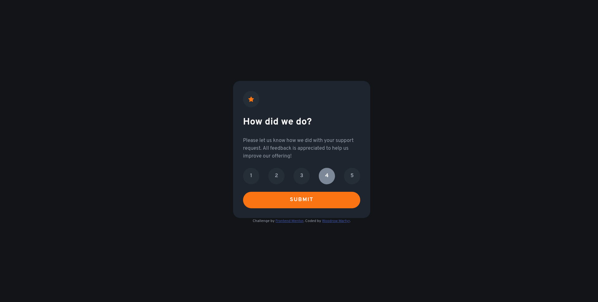
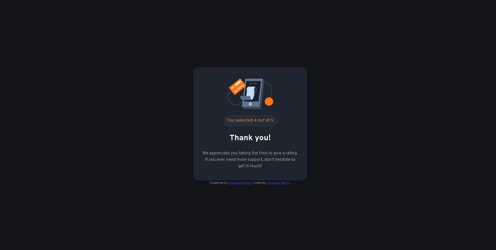

# Frontend Mentor - Interactive rating component solution

This is a solution to the [Interactive rating component challenge on Frontend Mentor](https://www.frontendmentor.io/challenges/interactive-rating-component-koxpeBUmI). Frontend Mentor challenges help you improve your coding skills by building realistic projects. 

## Table of contents

- [Overview](#overview)
  - [The challenge](#the-challenge)
  - [Screenshot](#screenshot)
  - [Links](#links)
- [My process](#my-process)
  - [Built with](#built-with)
  - [What I learned](#what-i-learned)
  - [Continued development](#continued-development)
  - [Useful resources](#useful-resources)
- [Author](#author)

## Overview

### The challenge

Users should be able to:

- View the optimal layout for the app depending on their device's screen size
- See hover states for all interactive elements on the page
- Select and submit a number rating
- See the "Thank you" card state after submitting a rating

### Screenshots

Rating Card

Thank You Card

### Links

- Solution URL: [https://github.com/wmartyr/interactive-rating-component-main](https://github.com/wmartyr/interactive-rating-component-main)
- Live Site URL: [https://wmartyr.github.io/interactive-rating-component-main](https://wmartyr.github.io/interactive-rating-component-main)

## My process

I started coding the HTML then styled the rating card first. And then tested the basic Javascript to see if I can retrieve the rating value and pass it on to the thank you card. After making sure that cards transition, I did the CSS for the thank you card.

### Built with

- Semantic HTML5 markup
- CSS custom properties
- Flexbox
- Mobile-first workflow
- Basic JS DOM manipulations and events

### What I learned

I had a chance to practice more HTML and CSS. This is my first Frontend Mentor challenge with JS.

### Continued development

There might be some techniques that would reduce the number of classes that I use. It's something that I can keep my eye on as I continue my learning journey.

### Useful resources

As usual, it's google, stack overflow, and w3schools.

## Author

- Frontend Mentor - [@wmartyr](https://www.frontendmentor.io/profile/wmartyr)
